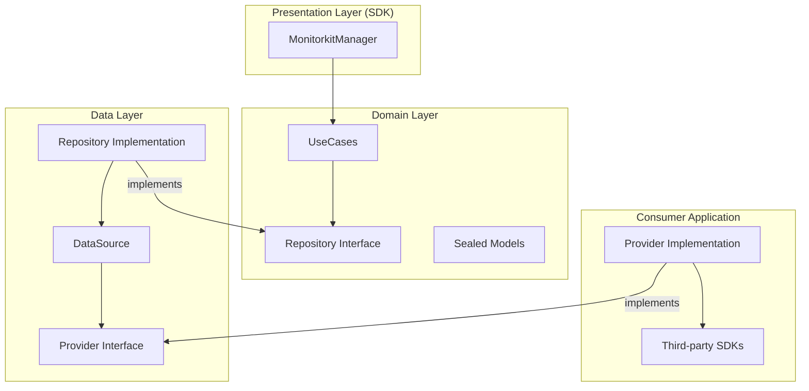

# Monitorkit

**"Data-driven decisions, not assumptions."**

Monitorkit is a powerful, lightweight Android library designed for real-time performance monitoring and system health tracking. It empowers developers to move beyond guesswork by providing precise metrics on resource consumption, network performance, and screen responsiveness.

## 🚀 Key Features

- **Resource Monitoring**: Track CPU and Memory usage.
- **Network Insights**: Measure response times and status of API calls.
- **Screen Performance**: Monitor loading times for activities and composables.
- **Custom Event Tracking**: Define and monitor business-specific events.
- **Agnostic Design**: Integrates seamlessly without forcing third-party dependencies.
- **Multi-Provider Support**: Route data to multiple consumers (Firebase, Sentry, etc.) simultaneously.
- **Hilt Ready**: Full support for Dependency Injection.

## 🏗 Architecture

Monitorkit is built using **Clean Architecture** to ensure long-term maintainability and isolation of business logic.



## 🛠 Usage Example (from Showcase)

### 1. Implement a Provider
Route library data to your monitoring service by implementing `MonitorProvider`.

```kotlin
class LogMonitorProvider(override val key: String = "LOGCAT") : MonitorProvider {
    override suspend fun trackEvent(event: MonitorEvent) {
        Log.d("Monitor", "Event: ${event.name}")
    }

    override suspend fun trackMetric(metric: PerformanceMetric) {
        when (metric) {
            is PerformanceMetric.Resource -> Log.d("Monitor", "Resource: ${metric.type}")
            is PerformanceMetric.Network -> Log.d("Monitor", "Network: ${metric.url}")
            is PerformanceMetric.ScreenLoad -> Log.d("Monitor", "Screen: ${metric.screenName}")
        }
    }
}
```

### 2. Initialize and Inject
The library is Hilt-ready. Simply inject `MonitorkitManager` and add your providers.

```kotlin
@HiltAndroidApp
class ShowcaseApp : Application() {
    @Inject lateinit var monitorkitManager: MonitorkitManager

    override fun onCreate() {
        super.onCreate()
        monitorkitManager.addProvider(LogMonitorProvider())
    }
}
```

### 3. Track Metrics
Use the manager to record different types of performance data.

```kotlin
// Track Network latency
monitorkitManager.trackMetric(
    PerformanceMetric.Network("https://api.example.com", "GET", 200L)
)

// Track Screen load time
monitorkitManager.trackMetric(
    PerformanceMetric.ScreenLoad("HomeActivity", 450L)
)
```

## 📂 Project Structure

- `:monitorkit`: The core library module.
    - `sdk`: Public API (`MonitorkitManager`).
    - `domain`: Business logic, Repository interfaces, and Sealed Metric models.
    - `data`: Repository implementation, DataSource, and Provider abstractions.
- `:showcase`: A sample app demonstrating Hilt integration and multiple metric types.

## 🧪 Quality Assurance

- **KDocs**: Complete API documentation.
- **Unit Testing**: 100% coverage of logic using **JUnit**, **MockK**, and **Coroutines Test**.
- **Efficiency**: Thread-safe provider management using `CopyOnWriteArrayList`.

---

*Developed with focus on performance and reliability.*
