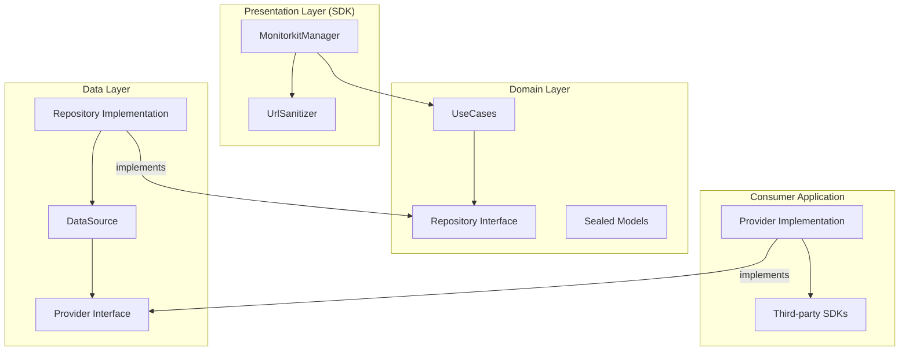

# Monitorkit

**"Data-driven decisions, not assumptions."**

Monitorkit is a powerful, lightweight Android library designed for real-time performance monitoring and system health tracking. It empowers developers to move beyond guesswork by providing precise metrics on resource consumption, network performance, and screen responsiveness.

## 🚀 Key Features

- **Resource Monitoring**: Track CPU and Memory usage.
- **Network Insights**: Measure response times, HTTP status codes, and API call details.
- **URL Sanitization**: Automatic masking of sensitive data (IDs, UUIDs) in URLs before reporting.
- **Screen Performance**: Monitor loading times for activities and composables.
- **Custom Event Tracking**: Define and monitor business-specific events.
- **Dynamic Provider Management**: Add or remove data consumers (Firebase, Sentry, etc.) at runtime.
- **Agnostic Design**: Integrates seamlessly without forcing third-party dependencies.
- **Hilt Ready**: Full support for Dependency Injection.

## 🏗 Architecture

Monitorkit is built using **Clean Architecture** to ensure long-term maintainability and isolation of business logic.



## 🛠 Usage Example

### 1. Initialize and Configure
Inject `MonitorkitManager` and configure sanitization rules.

```kotlin
@HiltAndroidApp
class ShowcaseApp : Application() {
    @Inject lateinit var monitorkitManager: MonitorkitManager

    override fun onCreate() {
        super.onCreate()
        
        // Add Providers
        monitorkitManager.addProvider(LogMonitorProvider())

        // Configure URL Sanitization
        monitorkitManager.configureUrlPatterns(listOf(
            "api/users/*/profile", // Matches: api/users/123/profile
            "auth/**"              // Matches: auth/v1/login
        ))
    }
}
```

### 2. Track Network Metrics
Sensitive URLs are automatically sanitized based on your patterns or generic rules.

```kotlin
// Input: https://api.example.com/api/users/88552/profile
// Output in Provider: https://api.example.com/api/users/*/profile
monitorkitManager.trackMetric(
    PerformanceMetric.Network("https://api.example.com/api/users/88552/profile", "GET", 200, 150L)
)

// Input: https://api.example.com/orders/999/details
// Output (Fallback): https://api.example.com/orders/*/details
monitorkitManager.trackMetric(
    PerformanceMetric.Network("https://api.example.com/orders/999/details", "GET", 200, 120L)
)
```

## 📂 Project Structure

- `:monitorkit`: The core library module.
    - `sdk`: Public API (`MonitorkitManager`) and Sanitization logic.
    - `domain`: Business logic, Repository interfaces, and Sealed Metric models.
    - `data`: Repository implementation, DataSource, and Provider abstractions.
- `:showcase`: A sample app demonstrating dynamic provider management and sanitization testing.

## 🧪 Quality Assurance

- **KDocs**: Complete API documentation.
- **Unit Testing**: 100% coverage including Regex sanitization logic.
- **Efficiency**: Thread-safe operations.

---

*Developed with focus on performance and reliability.*
