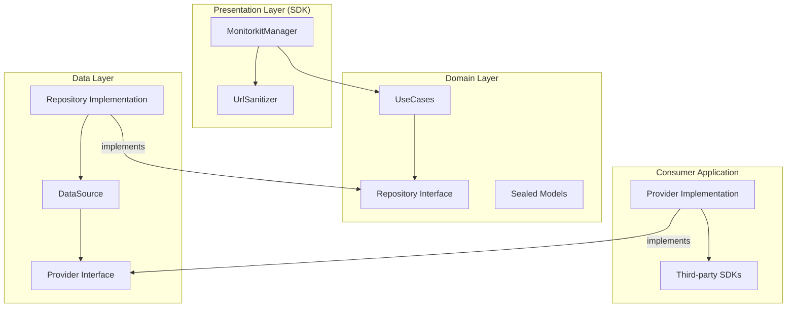

# Monitorkit

**"Data-driven decisions, not assumptions."**

Monitorkit is a powerful, lightweight Android library designed for real-time performance monitoring and system health tracking. It empowers developers to move beyond guesswork by providing precise metrics on resource consumption, network performance, screen responsiveness, and custom process durations.

## 🚀 Key Features

- **Resource Monitoring**: Track CPU and Memory usage.
- **Custom Tracing**: Measure the duration of specific processes (e.g., image processing, login). Supports both internal calculation and native provider delegation.
- **Network Insights**: Measure response times, HTTP status codes, and API call details.
- **URL Sanitization**: Automatic masking of sensitive data (IDs, UUIDs) in URLs before reporting.
- **Global Attributes**: Set persistent metadata (User ID, Environment, Experiment ID) across all providers.
- **Dynamic Provider Management**: Add or remove data consumers (Firebase, Sentry, etc.) at runtime.
- **Showcase Console**: Built-in real-time console in the showcase module to visualize captured data.
- **Hilt Ready**: Full support for Dependency Injection.

## 🏗 Architecture

Monitorkit is built using **Clean Architecture** to ensure long-term maintainability and isolation of business logic.



## 🛠 Usage Example

### 1. Initialize and Configure
Inject `MonitorkitManager` and configure sanitization rules.

```kotlin
@HiltAndroidApp
class ShowcaseApp : Application() {
    @Inject lateinit var monitorkitManager: MonitorkitManager

    override fun onCreate() {
        super.onCreate()
        
        // Add Providers
        monitorkitManager.addProvider(LogMonitorProvider())

        // Set Global Attributes
        monitorkitManager.setAttribute("env", "production")
        monitorkitManager.setAttributes(mapOf(
            "user_tier" to "premium",
            "app_version" to "1.0.0"
        ))
    }
}
```

### 2. Custom Tracing (Measure Duration)
You can measure how long a process takes.

```kotlin
// Start the timer
monitorkitManager.startTrace("image_compression", mapOf("format" to "png"))

// ... do heavy work ...

// Stop the timer and send the metric
monitorkitManager.stopTrace("image_compression", mapOf("status" to "success"))
```

*Note: You can enable `setUseNativeTracing(true)` to delegate start/stop calls directly to providers (e.g., for Firebase Performance Traces).*

### 3. Track Network Metrics
Sensitive URLs are automatically sanitized.

```kotlin
monitorkitManager.trackMetric(
    PerformanceMetric.Network("https://api.example.com/orders/999/details", "GET", 200, 120L)
)
// Output: https://api.example.com/orders/*/details
```

## 📂 Project Structure

- `:monitorkit`: The core library module.
    - `sdk`: Public API (`MonitorkitManager`) and Sanitization logic.
    - `domain`: Business logic, Repository interfaces, and Sealed Metric models.
    - `data`: Repository implementation, DataSource, and Provider abstractions.
- `:showcase`: A sample app demonstrating dynamic provider management, tracing, and a **real-time metric console**.

## 🧪 Quality Assurance

- **KDocs**: Complete API documentation.
- **Unit Testing**: 100% coverage including Tracing, Sanitization, and Attribute management.
- **Efficiency**: Thread-safe provider management using `CopyOnWriteArrayList` and `ConcurrentHashMap`.

---

*Developed with focus on performance and reliability.*
