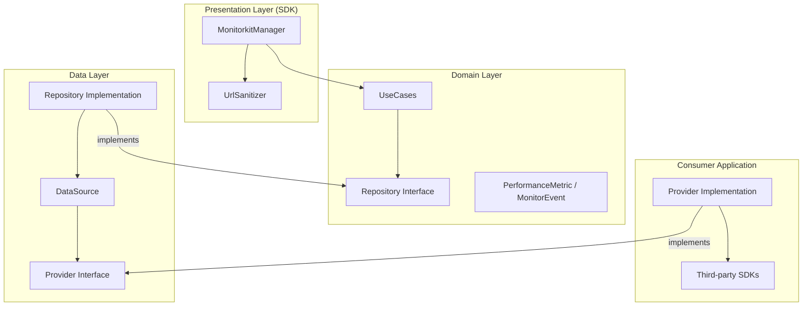

# Monitorkit

**"Data-driven decisions, not assumptions."**

Monitorkit is a powerful, lightweight Android library designed for real-time performance monitoring and system health tracking. It empowers developers to move beyond guesswork by providing precise metrics on resource consumption, network performance, screen responsiveness, and custom process durations.

## 🚀 Key Features

- **Resource Monitoring**: Track CPU and Memory usage.
- **Custom Tracing**: Measure process durations with internal calculation or native delegation.
- **Network Insights**: Capture response times and status codes with automatic **URL Sanitization**.
- **Screen Loading**: Measure time-to-interactive for Screens and Activities.
- **Custom Events**: Track specific business events with metadata.
- **Global Attributes**: Enrich data with persistent context (User ID, Environment).
- **Targeted Monitoring**: Send metrics or set attributes to specific providers using `providerKey`.
- **Dynamic Management**: Add/remove providers at runtime.
- **Showcase Console**: Built-in real-time console in the showcase module to visualize captured data.
- **Framework Agnostic**: Manual Dependency Injection via Builder pattern. No third-party DI dependencies.

## 🏗 Architecture

Monitorkit is built using **Clean Architecture** to ensure long-term maintainability and isolation of business logic.



## 🛠 Usage Example

### 1. Initialize and Configure
Use the `MonitorkitManager.Builder` to configure and instantiate the manager.

```kotlin
class ShowcaseApp : Application() {
    companion object {
        lateinit var monitorkitManager: MonitorkitManager
    }

    override fun onCreate() {
        super.onCreate()
        
        monitorkitManager = MonitorkitManager.Builder()
            .addProvider(LogMonitorProvider())
            .configureUrlPatterns(listOf("api/v1/users/*/profile", "api/v1/orders/**"))
            .setUseNativeTracing(false)
            .build()

        // Set Global Attributes
        monitorkitManager.setAttribute("env", "production")
        monitorkitManager.setAttributes(mapOf("user_tier" to "premium"))
    }
}
```

### 2. Track Events and Metrics
You can send data to all providers or target a specific one.

```kotlin
// Track a custom event
monitorkitManager.trackEvent("login_success", mapOf("method" to "google"))

// Track a screen load metric
monitorkitManager.trackMetric(PerformanceMetric.ScreenLoad("DashboardFragment", 250L))

// Targeted attribute (only for a specific provider)
monitorkitManager.setAttribute("debug_log", "true", providerKey = "log_provider")
```

### 3. Custom Tracing (Measure Duration)
Measure how long a process takes with `startTrace` and `stopTrace`.

```kotlin
// Start the timer
monitorkitManager.startTrace("image_upload", mapOf("size" to "2MB"))

// ... work ...

// Stop and report the duration
monitorkitManager.stopTrace("image_upload", mapOf("status" to "success"))
```

### 4. Network Metrics & Sanitization
Sensitive URLs are automatically masked based on your configuration.

```kotlin
monitorkitManager.trackMetric(
    PerformanceMetric.Network("https://api.example.com/users/123/profile", "GET", 200, 150L)
)
// Resulting URL: https://api.example.com/users/*/profile
```

## 📂 Project Structure

- `:monitorkit`: The core library module.
    - `sdk`: Public API (`MonitorkitManager`) and Sanitization logic.
    - `domain`: Business logic, Repository interfaces, and Metric/Event models.
    - `data`: Repository implementation, DataSource, and Provider abstractions.
- `:showcase`: A sample app demonstrating dynamic provider management, tracing, and a **real-time metric console**.

## 🧪 Quality Assurance

- **KDocs**: Complete API documentation.
- **Unit Testing**: 100% logic coverage with JUnit and MockK.
- **Efficiency**: Thread-safe operations using `CopyOnWriteArrayList` and `ConcurrentHashMap`.

---

*Developed with focus on performance and reliability.*
