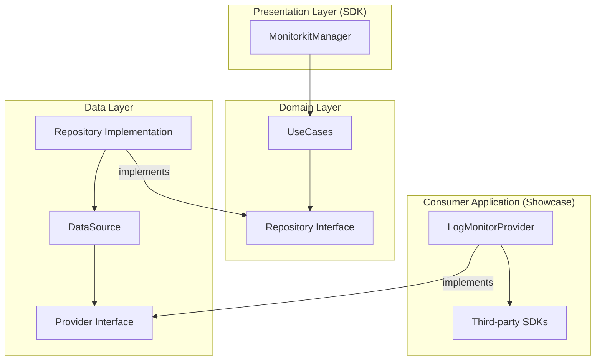

# Monitorkit

**"Data-driven decisions, not assumptions."**

Monitorkit is a powerful, lightweight Android library designed for real-time performance monitoring and system health tracking. It empowers developers to move beyond guesswork by providing precise metrics on resource consumption and application behavior.

## 🚀 Key Features

- **Real-time Monitoring**: Track CPU and Memory usage as they happen.
- **Custom Event Tracking**: Define and monitor business-specific events.
- **Diagnostics**: Identify performance bottlenecks before they impact users.
- **Agnostic Design**: Integrates seamlessly without forcing third-party dependencies on your project.
- **Multi-Provider Support**: Manage multiple data consumers (e.g., Firebase, Sentry, Custom API) through a single interface.
- **Hilt Ready**: Built-in support for Dependency Injection using Hilt.

## 🏗 Architecture

Monitorkit follows **Clean Architecture** principles, ensuring that business logic is isolated from external frameworks and delivery mechanisms.



## 🛠 Usage Example (from Showcase)

### 1. Implement a Provider
Create a class that implements `MonitorProvider` to route data to your preferred analytics or monitoring service.

```kotlin
class LogMonitorProvider(override val key: String = "LOGCAT") : MonitorProvider {
    override suspend fun trackEvent(event: MonitorEvent) {
        Log.d("Monitor", "Event: ${event.name}")
    }

    override suspend fun trackMetric(metric: PerformanceMetric) {
        Log.d("Monitor", "Metric: ${metric.type} = ${metric.value}")
    }
}
```

### 2. Initialize and Inject
The library is Hilt-ready. You can inject `MonitorkitManager` and configure your providers.

```kotlin
@HiltAndroidApp
class ShowcaseApp : Application() {
    @Inject lateinit var monitorkitManager: MonitorkitManager

    override fun onCreate() {
        super.onCreate()
        // Register your provider
        monitorkitManager.addProvider(LogMonitorProvider())
    }
}
```

### 3. Track Events and Metrics
Use the manager anywhere in your app to record data.

```kotlin
@AndroidEntryPoint
class MainActivity : ComponentActivity() {
    @Inject lateinit var monitorkitManager: MonitorkitManager

    fun onButtonClicked() {
        monitorkitManager.trackEvent("button_clicked", mapOf("id" to "save_btn"))
    }
}
```

## 📂 Project Structure

- `:monitorkit`: The core library module.
    - `sdk`: Public API and `MonitorkitManager`.
    - `domain`: Pure business logic (Models, UseCases, Repository Interfaces).
    - `data`: Implementation details (Repository, DataSource, Provider Abstractions).
- `:showcase`: Sample application demonstrating Hilt integration and custom providers.

## 🧪 Quality Assurance

- **KDocs**: 100% API documentation.
- **Unit Testing**: Robust suite using **JUnit**, **MockK**, and **Coroutines Test**.
- **Concurrency**: High-performance thread-safe state management using `CopyOnWriteArrayList`.

---

*Developed with focus on performance and reliability.*
