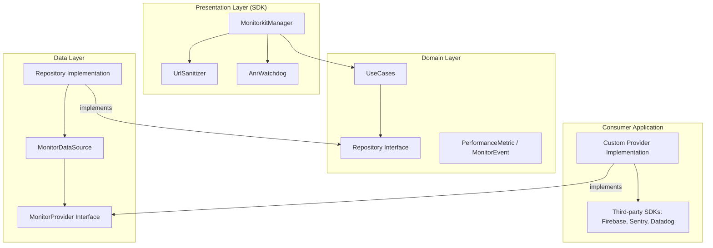

# Monitorkit

**"Data-driven decisions, not assumptions."**

Monitorkit is a lightweight, zero-dependency Android library designed for real-time performance monitoring and system health tracking. It empowers developers to move beyond guesswork by providing precise metrics on resource consumption, network performance, screen responsiveness, custom process durations, UI jank, ANRs, and app start latency.

---

## 🚀 Key Features

- **Zero Third-Party Dependencies in Core**: The `:monitorkit` library has zero external dependencies, remaining lightweight, secure, and fully agnostic of analytics or DI frameworks.
- **ANR Watchdog**: Background daemon thread that monitors the Android main thread, automatically detecting UI freezes and capturing comprehensive stack traces.
- **Jank & Frozen Frame Tracking**: Built-in support to record slow frames (>16ms) and frozen frames (>700ms) across app screens.
- **App Start Latency**: Measure and report cold, warm, and hot application startup durations.
- **Resource Monitoring**: Track CPU usage and Memory consumption.
- **Custom Tracing**: Measure process durations using internal calculation or native SDK delegation.
- **Network Insights & URL Sanitization**: Capture response latencies and status codes with built-in PII and ID masking (`*` and `**` wildcards, numeric and UUID redaction).
- **Screen Loading**: Measure time-to-interactive for screens, activities, and composables.
- **Custom Events & Global Attributes**: Enrich events with contextual metadata (User ID, Environment, App Version).
- **Targeted Monitoring**: Route specific metrics or attributes to designated providers via `providerKey`.
- **Dynamic Provider Management**: Add or remove monitoring providers at runtime in a thread-safe manner.

---

## 🏗 Architecture

Monitorkit adheres strictly to **Clean Architecture** principles to guarantee modularity, testability, and decoupling.


```mermaid
graph TD
    subgraph "Presentation Layer (SDK)"
        M[MonitorkitManager]
        S[UrlSanitizer]
        W[AnrWatchdog]
    end

    subgraph "Domain Layer"
        UC[UseCases]
        R[Repository Interface]
        MOD[PerformanceMetric / MonitorEvent]
    end

    subgraph "Data Layer"
        RepoImpl[Repository Implementation]
        DS[MonitorDataSource]
        P[MonitorProvider Interface]
    end

    subgraph "Consumer Application"
        ImplP[Custom Provider Implementation]
        ExtLib[Third-party SDKs: Firebase, Sentry, Datadog]
    end

    M --> S
    M --> W
    M --> UC
    UC --> R
    RepoImpl -- implements --> R
    RepoImpl --> DS
    DS --> P
    ImplP -- implements --> P
    ImplP --> ExtLib
```

---

## 📦 Implementation Guide for Consumer Apps

### 1. Implement a `MonitorProvider`

Consumer applications integrate third-party APMs (e.g., Firebase Performance, Sentry, Datadog, or custom analytics) by implementing the `MonitorProvider` interface.

```kotlin
class FirebaseMonitorProvider : MonitorProvider {
    override val key: String = "firebase_provider"

    override fun trackEvent(event: MonitorEvent) {
        // Log custom analytics event
        FirebaseAnalytics.getInstance(context).logEvent(event.name) {
            event.attributes.forEach { (k, v) -> param(k, v) }
        }
    }

    override fun trackMetric(metric: PerformanceMetric) {
        when (metric) {
            is PerformanceMetric.Jank -> {
                // Report slow or frozen frames
                Log.w("Performance", "Jank on ${metric.screenName}: ${metric.durationMs}ms (frozen: ${metric.isFrozen})")
            }
            is PerformanceMetric.Anr -> {
                // Report Application Not Responding incident
                Log.e("ANR", "Main thread blocked for ${metric.durationMs}ms:\n${metric.stackTrace}")
            }
            is PerformanceMetric.AppStart -> {
                Log.i("Performance", "App start (${metric.processType}): ${metric.durationMs}ms")
            }
            is PerformanceMetric.Network -> {
                // Metric URL is already sanitized by Monitorkit
                Log.i("Performance", "Network: ${metric.method} ${metric.url} -> ${metric.statusCode} in ${metric.durationMs}ms")
            }
            is PerformanceMetric.ScreenLoad -> {
                Log.i("Performance", "Screen Load: ${metric.screenName} took ${metric.durationMs}ms")
            }
            is PerformanceMetric.Resource -> {
                Log.i("Performance", "Resource: CPU=${metric.cpuUsage}%, Mem=${metric.memoryUsage}B")
            }
            is PerformanceMetric.Trace -> {
                Log.i("Performance", "Trace: ${metric.name} finished in ${metric.durationMs}ms")
            }
        }
    }

    override fun setAttribute(key: String, value: String) {
        FirebaseCrashlytics.getInstance().setCustomKey(key, value)
    }

    override fun setAttributes(attributes: Map<String, String>) {
        attributes.forEach { (k, v) -> setAttribute(k, v) }
    }

    override fun startTrace(name: String, attributes: Map<String, String>) {
        // Optional: delegate to Firebase Performance Trace
    }

    override fun stopTrace(name: String, attributes: Map<String, String>) {
        // Optional: stop Firebase Performance Trace
    }
}
```

---

### 2. Initialize `MonitorkitManager`

Initialize the centralized manager in your `Application.onCreate` using the fluent `Builder` API:

```kotlin
class MyApplication : Application() {
    companion object {
        lateinit var monitorkit: MonitorkitManager
            private set
    }

    override fun onCreate() {
        super.onCreate()

        monitorkit = MonitorkitManager.Builder()
            .addProvider(FirebaseMonitorProvider())
            .addProvider(DebugLogMonitorProvider())
            // Configure URL sanitization allowlist patterns (* for segment, ** for suffix)
            .configureUrlPatterns(listOf(
                "api/v1/users/*/profile",
                "api/v1/orders/**"
            ))
            // Enable ANR Watchdog with a custom threshold (default: 5000ms)
            .enableAnrWatchdog(timeoutMs = 5000L)
            .setUseNativeTracing(false)
            .build()

        // Set global context for all providers
        monitorkit.setAttribute("environment", "production")
        monitorkit.setAttribute("app_version", BuildConfig.VERSION_NAME)
    }
}
```

---

### 3. ANR (Application Not Responding) Watchdog

When enabled, the `AnrWatchdog` runs as a low-overhead background daemon thread (`Process.THREAD_PRIORITY_BACKGROUND`). It regularly pings the main thread handler:
- If the main thread fails to respond within `timeoutMs`, the watchdog captures the main thread's current stack trace.
- Dispatches a `PerformanceMetric.Anr(durationMs, stackTrace)` to all registered providers.
- Can be stopped at any time (e.g., during testing or when the app enters deep background):

```kotlin
monitorkit.stopAnrWatchdog()
```

---

### 4. Tracking Jank and Slow Frames

Record slow frames (e.g. integrated with AndroidX `JankStats` or `Window.OnFrameMetricsAvailableListener`):

```kotlin
// Track a slow frame (e.g., frame took 32ms)
monitorkit.trackJank(
    screenName = "FeedScreen",
    durationMs = 32L,
    isFrozen = false
)

// Track a frozen frame (> 700ms)
monitorkit.trackJank(
    screenName = "CheckoutScreen",
    durationMs = 780L,
    isFrozen = true
)
```

---

### 5. App Startup Measurement (Cold / Warm / Hot)

Track startup performance from application initialization to the first frame or interactive state:

```kotlin
// Cold start: Application process launch to interactive UI
val coldStartDuration = SystemClock.uptimeMillis() - appLaunchTime
monitorkit.trackAppStart(processType = "cold", durationMs = coldStartDuration)

// Warm / Hot start: Activity recreation or foreground transition
monitorkit.trackAppStart(processType = "warm", durationMs = warmStartDuration)
```

---

### 6. Network Telemetry & URL Sanitization

URLs tracked through `PerformanceMetric.Network` are automatically sanitized to strip sensitive path IDs or query parameters before reaching providers:

```kotlin
monitorkit.trackMetric(
    PerformanceMetric.Network(
        url = "https://api.example.com/v1/users/98765/details?token=secret123",
        method = "GET",
        statusCode = 200,
        durationMs = 185L
    )
)
// Sanitized URL received by providers:
// https://api.example.com/v1/users/*/details
```

---

### 7. Custom Traces (Process Durations)

Measure any asynchronous or multi-step workflow duration:

```kotlin
// Start trace
monitorkit.startTrace("checkout_flow", mapOf("cart_items" to "3"))

// ... business operations ...

// Stop trace (calculates duration and dispatches PerformanceMetric.Trace)
monitorkit.stopTrace("checkout_flow", mapOf("payment_method" to "credit_card"))
```

---

### 8. System Resources & Screen Load

```kotlin
// Track screen load time
monitorkit.trackMetric(PerformanceMetric.ScreenLoad("ProductDetailFragment", durationMs = 180L))

// Track device resource metrics
monitorkit.trackMetric(PerformanceMetric.Resource(cpuUsage = 14.5, memoryUsage = 52_428_800L))
```

---

### 9. Targeted Monitoring & Dynamic Providers

Target specific providers using `providerKey`:

```kotlin
// Only send this debug metric to the local log provider
monitorkit.trackEvent(
    name = "internal_debug_event",
    attributes = mapOf("details" to "verbose"),
    providerKey = "debug_log_provider"
)

// Dynamically add a provider at runtime
monitorkit.addProvider(CustomAnalyticsProvider())

// Remove a provider when no longer needed
monitorkit.removeProvider("custom_analytics_provider")
```

---

## 🧪 Integration with FoundationKit

When building your consumer application or testing suites, Monitorkit works seamlessly with **FoundationKit 2.0.0**:

- **Real-time Network Awareness**: Observe connectivity with FoundationKit's `NetworkMonitor` before initiating heavy telemetry dispatching.
- **Reliable Coroutine Testing**: Utilize `MainDispatcherRule` from `es.joshluq.kit:foundationkit-testing:2.0.0` in your unit tests:

```kotlin
@OptIn(ExperimentalCoroutinesApi::class)
class MyTelemetryTest {
    @get:Rule
    val mainDispatcherRule = MainDispatcherRule()

    @Test
    fun testTelemetryFlow() = runTest {
        // Clean coroutine execution with StandardTestDispatcher
    }
}
```

---

## 📂 Project Structure

- `:monitorkit`: The core library module.
  - `sdk`: Public API (`MonitorkitManager`), ANR Watchdog, and URL Sanitizer.
  - `domain`: UseCases, Repository interfaces, and Models (`PerformanceMetric`, `MonitorEvent`).
  - `data`: Thread-safe `MonitorDataSource`, Repository implementation, and `MonitorProvider` contract.
- `:showcase`: A reference application showcasing dynamic provider switching, ANR generation, jank simulation, real-time Compose metric console, and `NetworkMonitor` integration.

---

## 🗺️ Roadmap

Planned features for future releases:

1. **OkHttp / Ktor Automatic Interceptor (`:monitorkit-okhttp`)**:
   - Automated HTTP telemetry capturing status codes, latencies, and payload sizes.
   - Built-in integration with `UrlSanitizer`.
2. **Offline Buffering & Dispatching**:
   - In-memory ring buffer with persistent backing when disconnected.
   - Automatic batch dispatching once connectivity returns.
3. **Session Management & Breadcrumbs**:
   - `session_id` lifecycle tracking and circular breadcrumb history attached to ANRs and errors.

---

## 🛡️ Quality & Testing Standards

- **KDocs**: 100% documentation coverage on public APIs and interfaces.
- **Unit Testing**: Complete unit test suite with JUnit, MockK, and Coroutines Test.
- **Formatting**: Strictly verified with Spotless / ktlint (`./gradlew spotlessCheck`).
- **Thread Safety**: Backed by `CopyOnWriteArrayList` and `ConcurrentHashMap` for high-throughput concurrency.

---

*Data-driven decisions, not assumptions.*
